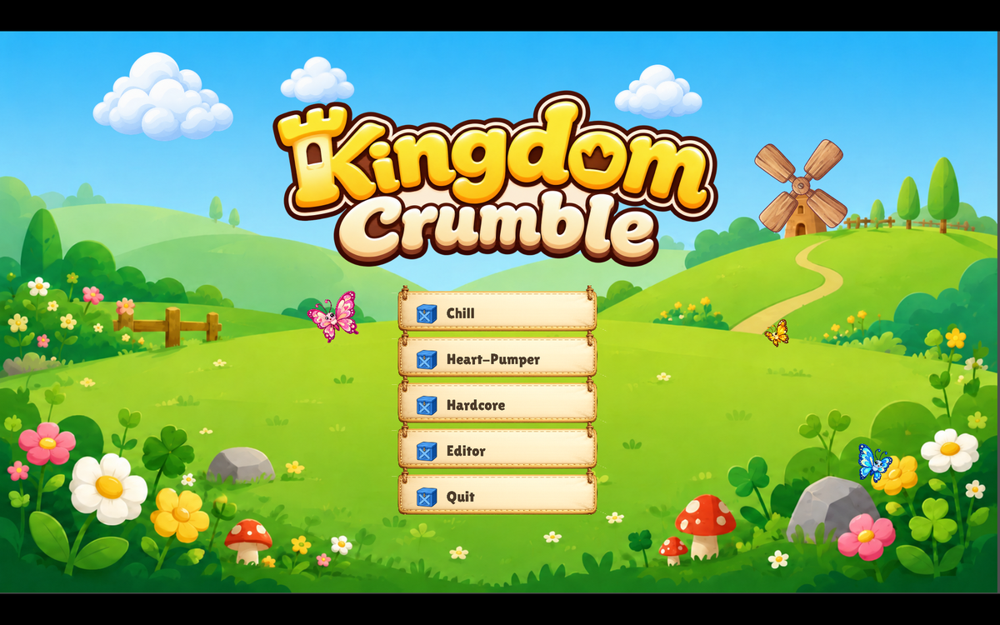
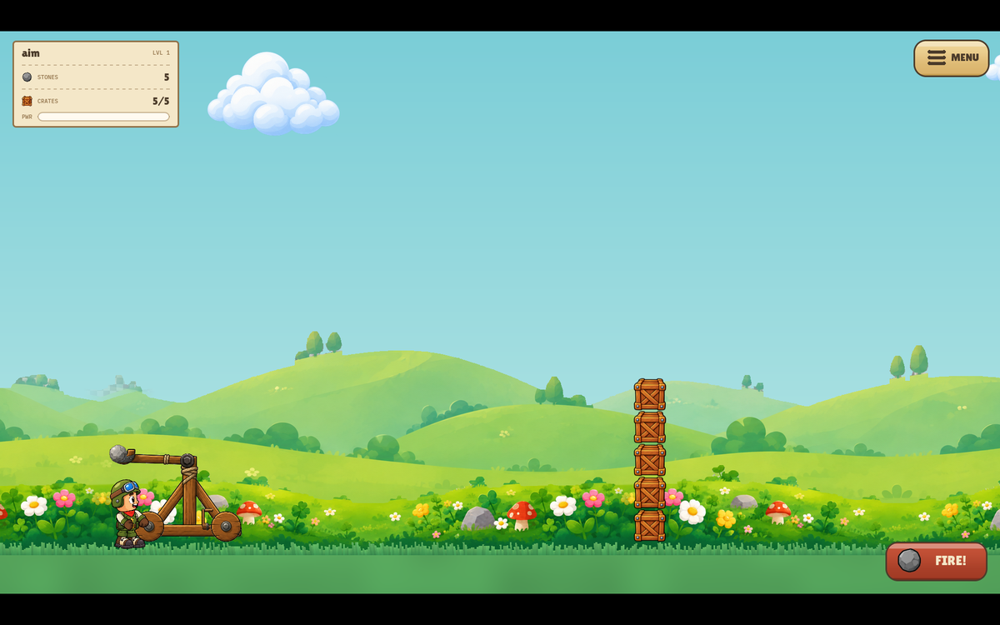
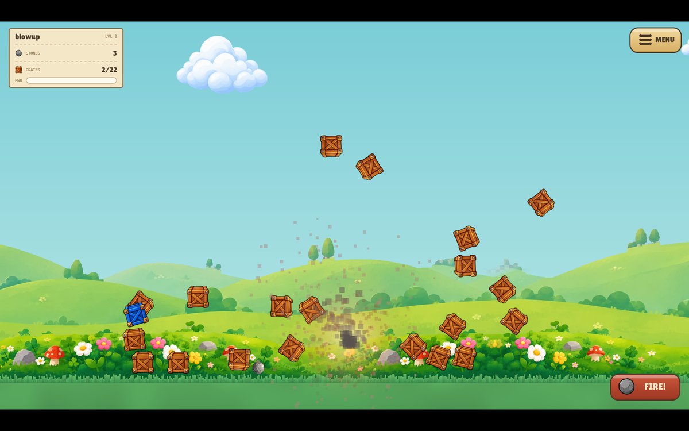
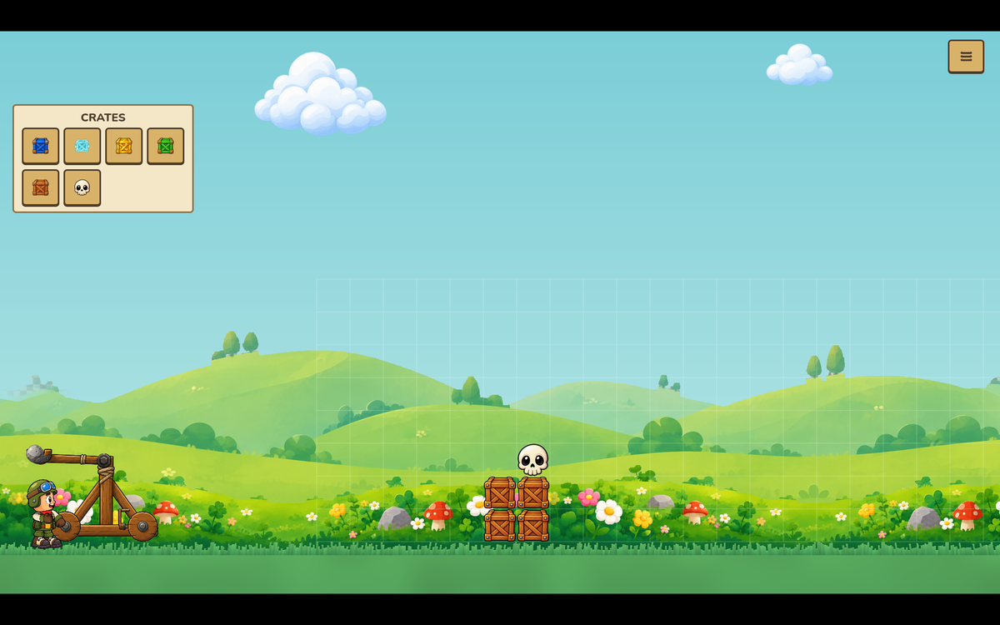
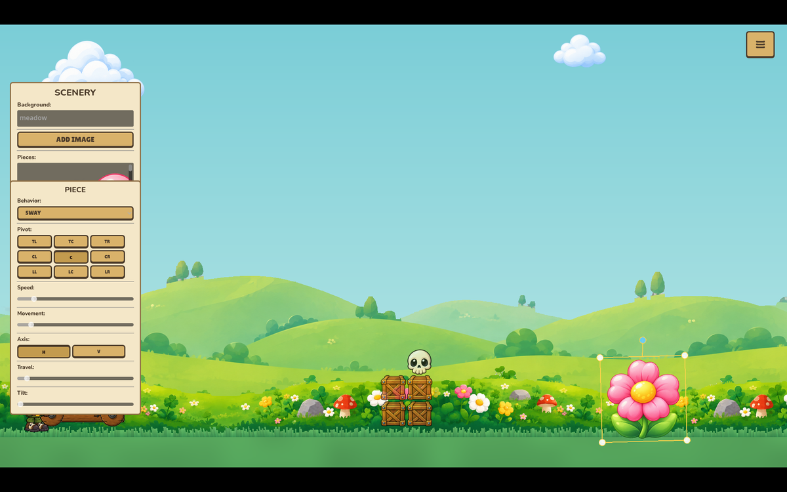

# Kingdom Crumble 👑

**A cozy 2D artillery game for the orphaned Angry Birds audience.**
Wind up the catapult, loose a stone, and bring the kingdom down —
crate by crate, across a hand-painted meadow that never stops moving.

### ▶️ [Play it in your browser](https://monumental-kringle-30a4d2.netlify.app)

No install, no account — the whole game runs on the web (and you can
*Add to Home Screen* on mobile to install it like a native app).

---

## The Game

Knock down every crate before your stones run out. Simple to start,
sneaky to master: special crates enchant your **next** shot, and the
buffs **stack** — chain a few together and you've built yourself a
bouncing, exploding, multi-stone catastrophe.

| Crate | What it does |
|---|---|
| 🟨 Gold | Free shot — your stone comes back |
| 💀 Skull | Your next shot explodes on impact |
| 🟦 Blue | Multi-shot |
| 🟩 Green | Super bounce — the stone keeps going |
| 👻 Ghost | Mystery — a random powerup |

## Build Your Own Kingdoms

The **full level editor is in the game** — desktop and browser alike.
Place crates on the grid, then open the scenery tools: import any
image, drag, scale, and rotate it into the world, and give it life
with animation verbs — *spin, sway, bob, drift, wander*. Windmills
turn, clouds commute, butterflies flutter.

Every level saves as a **single shareable file** with its own
screenshot embedded — send a friend one file and they have the whole
level, thumbnail and all.

## Features

- 🏹 **Physics artillery** — real trajectories, tumbling crates, lean
  bonuses for the stylish
- 🏰 **Three kingdoms of difficulty** — Chill, Heart-Pumper, and
  Hardcore, each with its own feel and its own soundtrack
- 🎵 **9 original music tracks** — from mossy-lantern calm to
  industrial menace, plus hand-made sound effects (yes, the crate
  impacts are a real tennis ball)
- 🎨 **All original art** — painted parallax meadows, drifting clouds,
  a living main menu with wandering butterflies and confetti-popping
  crates
- 🛠️ **In-game level editor** with custom image import, animated
  scenery, auto-captured thumbnails, and one-file level sharing
- 📈 **Progression & unlocks** — per-difficulty level chains, a level
  select, and rare unlockables (say hello to Mr. Skunk)
- 📱 **Plays everywhere** — browser, installable PWA, full touch
  support on mobile, desktop builds from source

## Under the Hood

- Built with **[Godot 4.6](https://godotengine.org)** — GDScript, no
  external dependencies
- **277 automated tests** (GUT) run headless on every change
- **NarfKit** — the game's tiny reusable component library
  (`addons/narfkit/`): living scenery, card flips, confetti bursts,
  and scene-fade transitions, all host-agnostic
- Shareable levels are **inert JSON** — data, never code, so opening a
  stranger's level is always safe
- Full design history in [docs/design.md](docs/design.md) and
  `docs/superpowers/` (every feature was specced, planned, and
  reviewed before it shipped)

## Heritage

Successor to the [castle-crasher](https://github.com/hazlema/castle-crasher)
web game (frozen as v1) — same catapult heart, entirely new kingdom.
