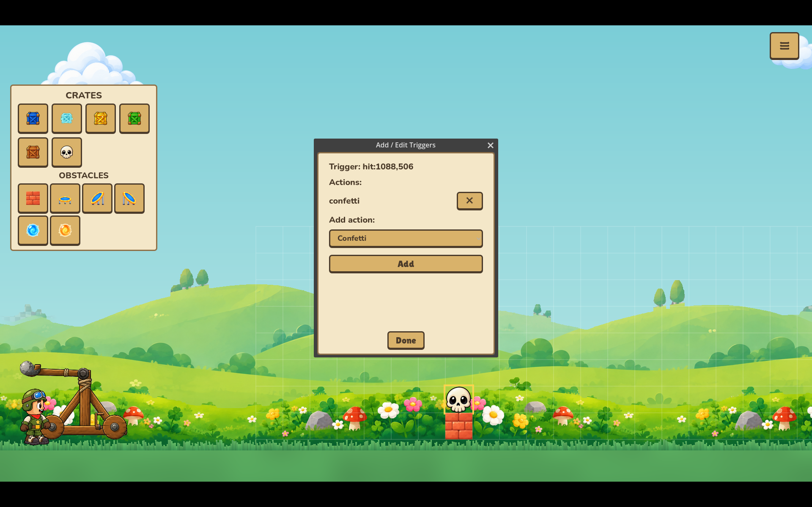
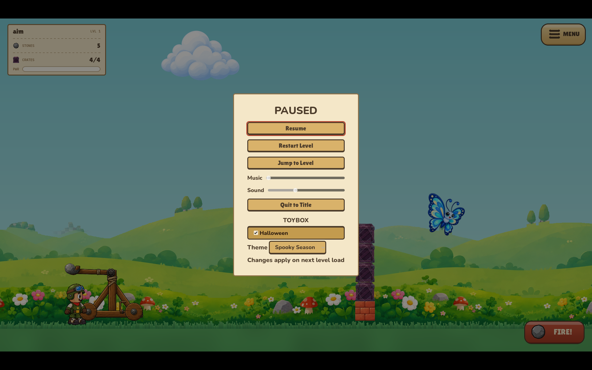
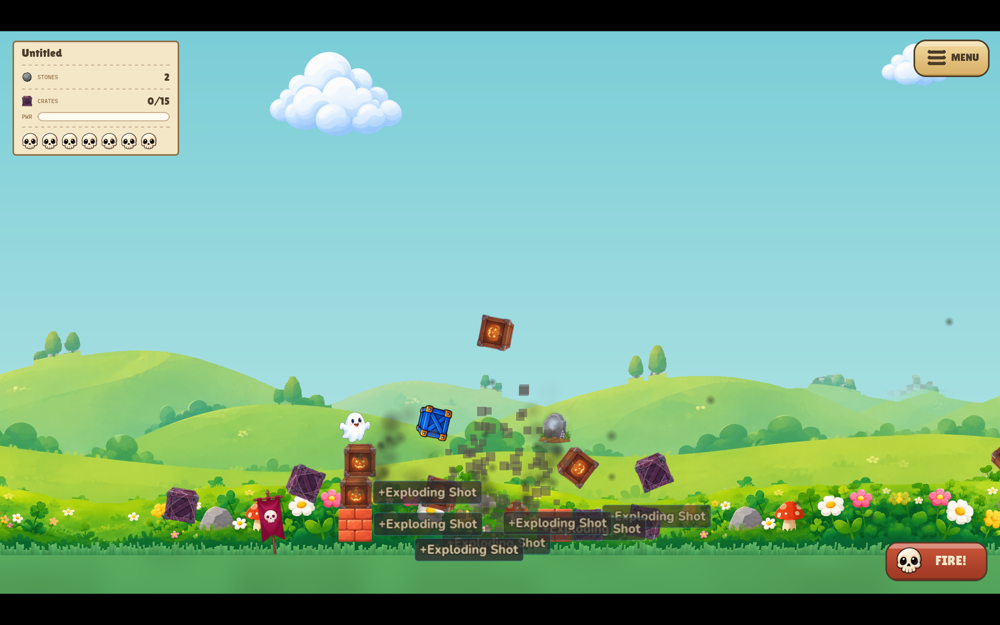

# Kingdom Crumble 👑


**A cozy 2D artillery game for the orphaned Angry Birds audience.**
Wind up the catapult, loose a stone, and bring the kingdom down —
crate by crate, across a hand-painted meadow that never stops moving.

### ▶️ [Play it in your browser](https://monumental-kringle-30a4d2.netlify.app)

No install, no account — the whole game runs on the web (and you can
*Add to Home Screen* on mobile to install it like a native app).
Prefer a native build? Grab **Linux, Windows, or macOS** from the
[releases page](https://github.com/hazlema/kingdom-crumble/releases).

---

## The Game

Knock down every crate before your stones run out. Simple to start,
sneaky to master: special crates enchant your **next** shot, and the
buffs **stack** — chain a few together and you've built yourself a
bouncing, exploding, multi-stone catastrophe.

| Crate | What it does |
|---|---|
| 🟨 Gold | Free shot — your stone comes back |
| 💀 Skull | Your next shot explodes on impact |
| 🟦 Blue | Multi-shot |
| 🟩 Green | Super bounce — the stone keeps going |
| 👻 Ghost | Mystery — a random powerup |


## Build Your Own Kingdoms

The **full level editor is in the game** — desktop and browser alike.
Place crates on the grid, then open the scenery tools: import any
image, drag, scale, and rotate it into the world, and give it life
with animation verbs — *spin, sway, bob, drift, wander*. Windmills
turn, clouds commute, butterflies flutter.

Every level saves as a **single shareable file** with its own
screenshot embedded — send a friend one file and they have the whole
level, thumbnail and all.

Crates are just the beginning. Lay **brick walls** to shield your
towers, angle **trampolines** to bank impossible shots, and place
**wormholes** in pairs — a stone that enters one comes out the other
with its speed intact, which sounds simple until you discover you can
*roll* a stone gently into a portal and have it plop out somewhere
devious. Spin the portal and the exit sweeps like a roulette wheel;
your timing is the aim.

Then wire it all together with **triggers**: right-click any crate and
tell the level what happens when it's hit. Signs vanish, messages pop
up on screen, confetti flies, sounds play, and crates catch fire and
**smolder in any color you like**. Our tutorial levels are built
entirely out of this — labeled targets whose signs disappear as you
learn each mechanic. No scripting, no code: just clicks.




## The Toybox 🧸

Kingdom Crumble has a **drop-in content system**. A pack is just a
folder you put in the game's `toybox` directory — no install step, no
tooling:

- **Object packs** add brand-new pieces: new crates (which can carry
  any of the game's powers), new obstacles, new portals. Pack pieces
  get their own namespace, so a hundred packs can coexist without a
  single collision.
- **Theme packs** reskin the game you already have. Drop in a
  Thanksgiving theme and *every level you own becomes a Turkey level* —
  same physics, same solutions, new wardrobe. One theme at a time,
  switchable from the pause menu.
- **Seasons** — a pack can declare its months. A Halloween theme grays
  itself out in spring ("returns in October") and politely steps aside
  when its season ends. Time travelers with adjustable system clocks
  are welcome.

Everything is toggled from a **Toybox section in the pause menu**, and
none of it can break your game: pack files pass the same hostile-input
gates as everything else. A broken pack is a log warning, never a
crash.





## Roll Your Own Pieces 🔧

Here's the part for the tinkerers: **every object in the game is one
PNG and one tiny JSON file.** This is real, shipped, and how we build
the game ourselves:

```json
{ "class": "crate", "powerup": "exploding",
  "aura": "smog", "aura_color": "#4dd933",
  "tip": "Jack-o'-crate — handle with care" }
```

That's a complete new crate: it explodes, it smolders green, it has a
tooltip. Drop the JSON next to a 64×64 PNG and it appears in the
editor palette. The `class` decides what it *is* — a crate, a solid
block, a trampoline (with its bounce and tilt as dials), a wormhole.
Sidecars **pick and tune from curated sets**; the mechanics themselves
live in the engine. That's a security stance, not a limitation: a pack
you downloaded from a stranger can say *"I'm an exploding crate that
smokes purple"* — it can never say *"run this code."* New mechanics
ship in game updates and become instantly available to every pack ever
made.

The full field manual — image rules, every sidecar key, trigger
authoring, pack anatomy — lives in **[parts.md](parts.md)**. If you
can make a PNG, you can mod this game.

## Features

- 🏹 **Physics artillery** — real trajectories, tumbling crates, lean
  bonuses for the stylish
- 🏰 **Three kingdoms of difficulty** — Chill, Heart-Pumper, and
  Hardcore, each with its own feel and its own soundtrack
- 🎵 **9 original music tracks** — from mossy-lantern calm to
  industrial menace, plus hand-made sound effects (yes, the crate
  impacts are a real tennis ball)
- 🎨 **All original art** — painted parallax meadows, drifting clouds,
  a living main menu with wandering butterflies and confetti-popping
  crates
- 🛠️ **In-game level editor** with custom image import, animated
  scenery, a point-and-click trigger system, auto-captured thumbnails,
  and one-file level sharing
- 🌀 **Physics toys** — trampolines, brick walls, and paired wormholes
  that preserve your momentum (and your spin — rolling into a portal
  is a legitimate strategy)
- 🧸 **The Toybox** — drop-in content packs and seasonal reskin themes,
  no tools required
- 📈 **Progression & unlocks** — per-difficulty level chains, a level
  select, and rare unlockables (say hello to Mr. Skunk)
- 🏅 **Deeds of the Kingdom** — a parchment page of medallion achievements
  earned through play. Unlocks stamp live onto the screen with a gold ribbon
  and confetti; the full gallery is one button from the main menu. Adding a
  new deed is a content act — paint the art, drop it in, add one line to the
  manifest
- 📱 **Plays everywhere** — browser, installable PWA, full touch
  support on mobile, desktop builds from source

## Under the Hood

- Built with **[Godot 4.6](https://godotengine.org)** — GDScript, no
  external dependencies
- **423 automated tests** (GUT) run headless on every change
- **NarfKit** — the game's tiny reusable component library
  (`addons/narfkit/`): living scenery, card flips, confetti bursts,
  and scene-fade transitions, all host-agnostic
- Shareable levels and content packs are **inert JSON** — data, never
  code — with typed validation, size caps, and pre-decode image budgets
  on everything a stranger's file can carry
- The whole object system is data-driven: see **[parts.md](parts.md)**
  for how pieces, powers, auras, and triggers fit together
- Full design history in [docs/design.md](docs/design.md) and
  `docs/superpowers/` (every feature was specced, planned, and
  reviewed before it shipped)

## Heritage

Successor to the [castle-crasher](https://github.com/hazlema/castle-crasher)
web game (frozen as v1) — same catapult heart, entirely new kingdom.
